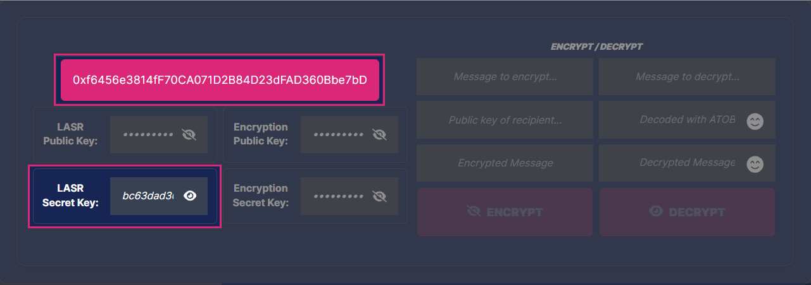
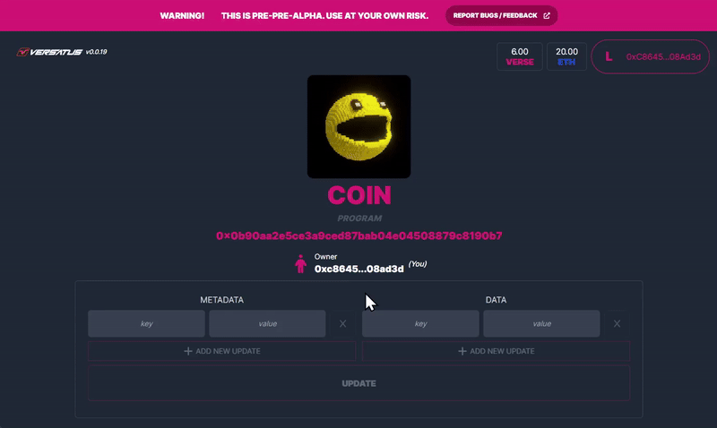

import MediaWrapper from '../../../src/components/Media/MediaWrapper';
import LinkCards from '../../../src/components/Cards/LinkCards';

The LASR framework provides an agnostic platform for developers to create contract-based applications. This page outlines a process to deploy your first dAapp using LASR.

:::info
  Currently, LASR is only available for JavaScript and TypeScript. The example on this page uses Typescript. However, Versatus is constantly working to expand the supported programming languages.
:::

## Prerequisites

The only prerequisite to start setting up your project is to have [Node.js](https://nodejs.org/docs/latest/api/synopsis.html) V18 or newer installed on your system. If you don't have Node.js, you need to install it, otherwise, you can continue with the configuration.

:::note
Currently, LASR doesn't support Windows. If you are trying to deploy it in a Windows OS, Versatus suggests installing a WSL.
:::

## Hello LASR

The following steps will guide you in creating a hello-lasr program and deploying it. With this, you will begin to understand the power of LASR.

### Step 1: Set Up Your Project

With the only prerequisite met, Follow the steps below to set up a new project:

1. Create your new project, creating its directory and starting a new [Typescript](https://www.typescriptlang.org/docs/) project in it. Run the following to perform all this process:

```bash copy
mkdir your-project-name \
&& cd your-project-name \
&& npm init -y \
&& npm install typescript --save-dev \
&& npx tsc --init
```

2. Install the [@versatus/versatus-javascript package](https://www.npmjs.com/package/@versatus/versatus-javascript): 

```bash copy
npm install --save @versatus/versatus-javascript
```

This package provides essential tools and interfaces for developing programs for the LASR network using Typescript. It contains types, classes, functions, and examples that facilitate the creation of LASR programs. The package also comes with several functions and a CLI. You can use the CLI to initialize, build, deploy, and call programs on the network directly from the terminal.

### Step 2: Start the Project

With the project set up, you will now initialize a new LASR project. You can use a variety of templates to perform this. In this tutorial, you will use the `hello-lasr`:

```bash copy
npx lasrctl init hello-lasr
```

:::info
For more details about the available templates, access the [Templates](/lasr/core_concepts/templates) page. 
:::

The `init` command will generate an example program named example-program.ts, located at the root of your project. In addition, it also generates a folder containing example JSON inputs for each method within the inputs directory. These JSON files have examples of what the LASR protocol will send your program. For more information about how the protocol works, access the [LASR Protocol](/lasr/core_concepts/lasr_protocol) page.

### Step 3: Set up your Wallet Keys

When the `lasrctl` command `init` ran in [Step 2](#step-2-start-the-project), it also generated a `.lars/wallet/keypairs.json` file in the project. These addresses are used to connect your account, created in the [Creating an Account](/lasr/getting_started/creating_an_account) page to the program you will deploy. You need to replace `address` and `secret_key` with your own:

1. Access [LASR Playground](http://faucet.versatus.io/).
2. Connect LASR Wallet.
3. Copy the address and the LASR Secret Key found on the Playground:
<MediaWrapper>

</MediaWrapper>
4. Replace the `address` and the `secret_key` values in the `keypairs.json` file with your new values.

:::warning
  It is crucial to keep your `keypair.json` file secure at all times. This file holds sensitive information that, if exposed, could lead to unauthorized access, loss of funds, or even malicious deployments under your identity. 
  Therefore, keep in mind the following recommendations:

  - Do not share this file with anyone, since it contains unique identifiers that authenticate your transactions and access to your account.
  - Avoid committing this file to public repositories to avoid making the file vulnerable to unauthorized access.
  - Consider using secret management tools or services. These tools provide a secure way to store sensitive information, such as your `keypair.json` file, without exposing it to potential threats.
:::

By doing this, you are ready to continue the deploy process of your first LASR application.

### Step 4: Build Your Program

Before deploying your program, you need to compile your TypeScript code into JavaScript. This process uses Webpack to consolidate your entire program into a single, deployable file. If you modify your TypeScript code, remember to rebuild your program to ensure that any changes you've made are incorporated into the version of the program that will be deployed. To do this, use the following command:

```bash copy
npx lasrctl build example-program.ts
```

The command compiles your TypeScript program and outputs the resulting JavaScript file into the `./build` directory.

:::info
  Note that the `./build` directory should not be included in your source control system.
:::

### Step 5: Test Your Program

Now that you have built your program, you can validate its performance against sample JSON inputs that it might encounter in real-world scenarios, as defined by the LASR protocol. To facilitate this process, Versatus prepared a set of sample input JSON files located in the `./inputs` directory of your project. For more information about how the protocol works, access the [LASR Protocol](/lasr/core_concepts/lasr_protocol) page.

To initiate the testing process, use the following command in your terminal:

```bash copy
npx lasrctl test -b example-program -i example-program-inputs
```

The `lasrctl` command iterates through each JSON file in the specified `./example-program-inputs` directory, feeding them into your program. The results of these operations are displayed in the terminal, providing a series of messages indicating the validation status of your program's output. Following is an example of what you can expect to see:

:::note
Additionally, you can specify individual files to test specific methods, which will also give you a more verbose output.
:::

```bash
Validating the PROGRAM OUTPUT...
*******************************
Output is valid ✅ 
*******************************
Tested input: lasr-hello-token-update.json

*******************************
Output is valid ✅ 
*******************************
Tested input: lasr-hello-create.json

All tests completed. Summary of results:
Test 1 (lasr-hello-create.json): Passed
Test 2 (lasr-hello-token-update.json): Passed
```

These messages confirm that your program has successfully processed the sample inputs and produced valid output, as per the LASR protocol's requirements.

With these tests successfully completed, your program is now prepared for deployment on the LASR network, meaning your program is ready to interact with the LASR network. If the messages display errors, you must fix your program before deploying it to ensure it works properly with the LASR network.

### Step 6: Deploy Your Program

You can now start the deploy process using the `npx lasrctl deploy` command. Below is the command you need to run to deploy your `hello-lasr` application:

```bash copy
npx lasrctl deploy --build example-program --symbol HELLO_WORLD --programName MY_FIRST_PROGRAM
```

:::warning
  Sometimes the first try of a deploy may not work, if this happens just rerun the `deploy` command and it will likely succeed on the second try.
:::

Access the [Deploy Configuration](/lasr/lasr_guides/deploy_configuration) page to learn more about the available parameters you can use when deploying your program.

## Interacting With Your Program

You can interact with the deployed program using the LASR CLI or through the link received once the deploy command finishes. 

- **LASR CLI**: It's installed together with  [@versatus/versatus-javascript package](https://www.npmjs.com/package/@versatus/versatus-javascript) and enables you to interact and test your program using your terminal. To learn more about the available CLI features, access the [LASR CLI](/lasr/lasr_guides/cli) page.

- **Browser**: Once the deploy is finished, it will  provide you with a URL that can be used in any web browser to interact with your program. This URL will be similar to the following:

```
https://playground.versatus.io/programs/0x0b90aa2e5ce3a9ced87bab04e04508879c8190b7
```
<MediaWrapper>

</MediaWrapper>

:::note
  In this tutorial case you don't need VERSE Credits in your wallet. For others that you may require in the future, you can access [Versatus Discord](https://discord.com/invite/versatus) server, and request credits through the `/faucet <address>` command in the [faucet channel](https://discord.com/channels/1034112774789414963/1228424731955433493).
:::

## What's Next?

Now that you deployed and tested your first LASR program, you can advance in your journey to create dApps. To better understand how to create and test dApps, access one of the core concepts pages:

<LinkCards numColumns={2} data={[
  { 
    title: 'Blockchain Fundamentals',
    linkTo: '/lasr/core_concepts/blockchain_fundamentals',
  },
  { 
    title: 'LASR Protocol',
    linkTo: '/lasr/core_concepts/lasr_protocol',
  },
  { 
    title: 'Templates',
    linkTo: '/lasr/core_concepts/templates',
  },
]}/>

In case you want to explore the LASR features, you can access one of the following options:

<LinkCards numColumns={2} data={[
  { 
    title: 'LASR Tutorials',
    linkTo: '/lasr/tutorials',
  },
  { 
    title: 'LASR CLI',
    linkTo: '/lasr/lasr_guides/',
  },
  { 
    title: 'Deploy Process',
    linkTo: '/lasr/lasr_guides/deploy_process',
  },
  { 
    title: 'Deploy Configurations',
    linkTo: '/lasr/lasr_guides/deploy_configuration',
  },
]}/>