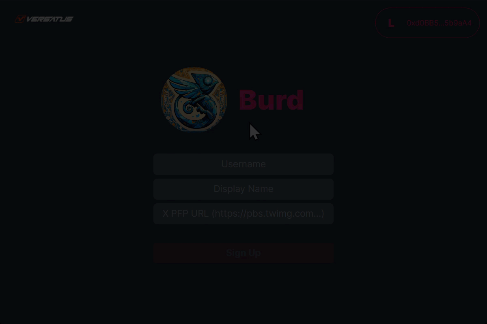
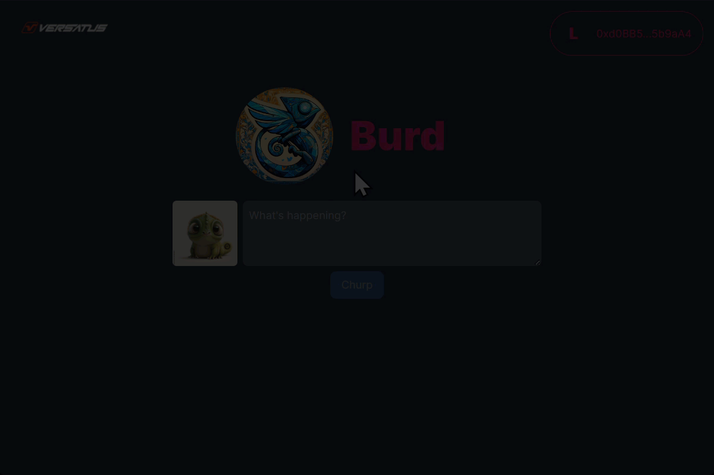
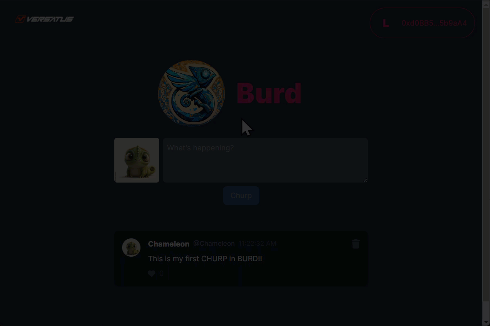
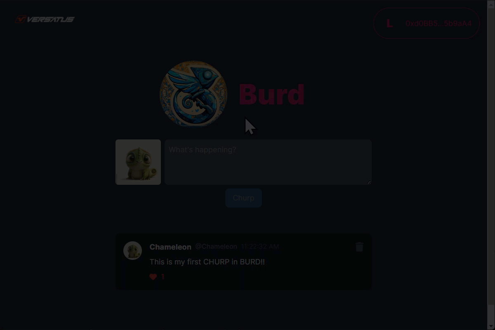

import MediaWrapper from '../../../../src/components/Media/MediaWrapper';
import ImageComponent from '../../../../src/components/Media/ImageComponent';
import Tabs from '@theme/Tabs';
import TabItem from '@theme/TabItem';

Congratulations on deploying BURD and familiarizing yourself with its codebase. Now, you can explore how the frontend interacts with a LASR project, providing practical insights into adapting BURD for your specific requirements.

## Running the Frontend

To interact with the BURD frontend, execute the following steps:

### Step 1: Configure Your Environment Variables

In the [last step](/lasr/tutorials/burd/deploy#step-4-deploy-burd) of the deployment, you were required to save the `program address` from the CLI output. Use this, along with credentials from your `keypairs.json` file, to link the frontend with your BURD project:

1. Navigate to the `frontend` directory and open the `.env` file.
3. Update the `NEXT_PUBLIC_BURD_PROGRAM_ADDRESS` variable with the `program address` you saved earlier.
4. Set `NEXT_PUBLIC_BURD_OWNER_ADDRESS` to the address in the `lasr/.lasr/wallet/keypair.json` file.
5. Insert the secret key from the same `keypair.json` file into the `BURD_OWNER_SECRET_KEY` variable.

### Step 2: Launch the Frontend

First, navigate to the frontend directory and install the required dependencies. Then you're ready to start the frontend server by executing the following commands:

```sh copy
cd frontend \
&& npm install \
&& npm run dev
```

You can now explore the functionalities of BURD.

## Using BURD

BURD allows users to engage with a variety of features on the blockchain. Following, you will find description and sequence diagrams of how each of these actions works, interacting with the main program and with users' NFTs:

<Tabs>

  <TabItem label="Add User" value="Add User">
  The `addUser` method will register a new user in the main program. The GIF below presents an example of adding a user in the frontend application:

  <MediaWrapper>
  
  </MediaWrapper>

  The add user process above is broken down below:

  1. The user inputs its data (`username`, `handle`, `imgUrl`) and clicks the register button, calling the `addUser()` method.
  2. The BURD program registers the user's data in its own NFT.
  3. BURD grabs an available `tokenId` and registers it to the user's NFT, adding BURD's program address to the user's NFT.
  4. BURD returns the transaction data to the CLI/frontend, and requests approval to modify the user's NFT in future transactions. For example, when another user likes a churp from the current user.
  5. The user clicks the **Approve BURD to Get Started** button, calling the `approve()` method, giving permission to BURD.

  The following diagram exemplifies the above process using a sequence diagram:
  
  <ImageComponent className="addUser"/>

  </TabItem>

  <TabItem label="Churp" value="Churp">
  The `churp` method creates a new churp, registering it to the creator's NFT. The GIF below presents an example of creating a churp in the frontend application:

  <MediaWrapper>
  
  </MediaWrapper>

  The process of creating a churp is broken down below:

  1. The user inputs the content of the churp and clicks the **Churp** button, calling the `churp` method.
  2. The BURD program registers the churp into the user's NFT.
  3. The program returns the transaction data to the frontend.

  The following diagram exemplifies the above process using a sequence diagram:

  <ImageComponent className="churp"/>
  
  </TabItem>

  <TabItem label="Like" value="Like">
  The `like` method registers your approval on an existing churp by adding the like information in the churp creator's NFT. The GIF below presents an example of liking a churp in the frontend application:

  <MediaWrapper>
  
  </MediaWrapper>

  The liking process above is broken down below:

  1. The user clicks the like button in any churp, calling the `like` method.
  2. The program registers the like into the churp owner's NFT, linking the user's address to the churp's owner NFT.
  3. The program returns the transaction data to the frontend.

  The following diagram exemplifies the above process using a sequence diagram:

  <ImageComponent className="like"/>

  </TabItem>

  <TabItem  label="Delete Churp" value="Delete Churp">
  The `deleteChurp` method removes one of the user's previous churps, deleting its data from the user's NFT. The GIF below presents an example of deleting a churp in the frontend application:

  <MediaWrapper>
  
  </MediaWrapper>

  The process of deleting a churp is broken down below:

  1. The user clicks the trash button of an owned churp, calling the `deleteChurp` method.
  2. The program removes all content from the churp from the user's NFT, removing likes from it.
  3. The program returns the transaction data to the frontend.

  The following diagram exemplifies the above process using a sequence diagram:

  <ImageComponent className="deleteChurp"/>
  
  </TabItem>

</Tabs>

## Frontend and LASR Interaction

To better understand the BURD application, you need to understand the interaction between the frontend and LASR. The frontend communicates with the LASR project you deployed using a JSON-RPC API. This network protocol enables data exchange between clients and servers. 

The JSON-RPC is a remote procedure call (RPC) protocol encoded in JSON. It allows for calling functions remotely and supports multiple data structures. A JSON-RPC request includes the following fields:

- **jsonrpc**: Specifies the version of the JSON-RPC protocol. 
- **method**: The name of the method to be invoked on the server.
- **params**: The parameters to be passed to the method. This can be an array or an object.
- **id**: A unique identifier for the request, which helps match the response with the corresponding request.

The code snippet below is an example of how a BURD frontend application communicates with the LASR server using the Axios library:

```js copy showLineNumbers
await axios.post('http://lasr-sharks.versatus.io:9292', {
  jsonrpc: '2.0',
  method: 'lasr_getAccount',
  params: [programAddress],
  id: 1,
})
```

:::note
`http://lasr-sharks.versatus.io:9292` is the endpoint URL where the LASR server listens for requests.  
:::

Every time a user interacts with the frontend, creating a churp or linking, a new request is sent to the Deploy, triggering the methods described before.
