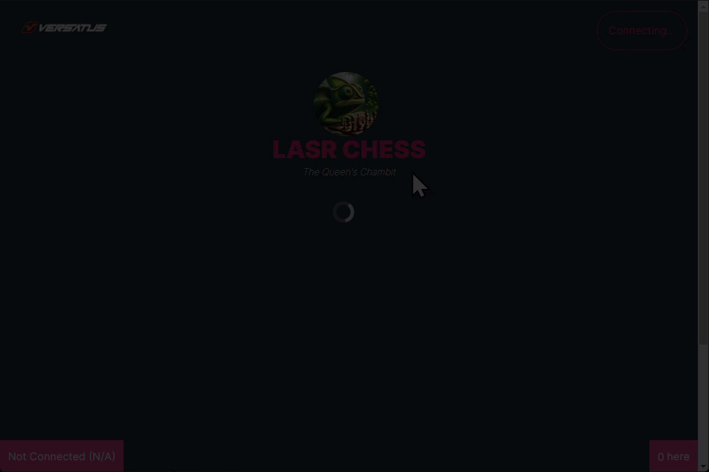

import MediaWrapper from '../../../../src/components/Media/MediaWrapper';
import ImageComponent from '../../../../src/components/Media/ImageComponent';
import Tabs from '@theme/Tabs';
import TabItem from '@theme/TabItem';

Congratulations on deploying LASR Chess and familiarizing yourself with its codebase. Now, you can explore how the frontend interacts with a LASR project, providing practical insights into adapting LASR Chess for your specific requirements.

## Running the Frontend

To interact with the LASR Chess frontend, execute the following steps:

### Step 1: Configure Your Environment Variables

In the [last step](/lasr/tutorials/chess/deploy#deploy-lasr-chess) of the deployment, you were required to save the `program address` from the CLI output. Use this, along with credentials from your `keypairs.json` file, to link the frontend with your LASR Chess project:

1. Navigate to the `frontend` directory and rename the `.env.example` file to `.env`.
3. Update the `NEXT_PUBLIC_CHESS_PROGRAM_ADDRESS` variable with the `program address` you saved earlier.
4. Set `NEXT_PUBLIC_CHESS_OWNER_ADDRESS` to the address in the `lasr/.lasr/wallet/keypair.json` file.
5. Insert the secret key from the same `keypair.json` file into the `CHESS_OWNER_PRIVATE_KEY` variable.

### Step 2: Launch the Frontend

First, navigate to the frontend directory and install the required dependencies. Then you're ready to start the frontend server by executing the following commands:

```sh copy
cd app \
&& npm install \
&& npm run dev
```

You can now explore the functionalities of LASR Chess.

## Playing Chess

LASR Chess allows users to engage with a variety of features on the blockchain. Following, you will find description and sequence diagrams of how each of these actions works, interacting with the main program and with users' NFTs:

<Tabs>

  <TabItem label="Register User" value="Register User">
    The `registerUser` method will register a new user in the main program. The GIF below presents an example of adding a user in the frontend application:

    <MediaWrapper>
    
    </MediaWrapper>

    The register user process above is broken down below:

    1. The user inputs its data and clicks the register button
    2. The application calls the `registerUser()` method.
    3. The LASR Chess program registers the user's data in its own NFT.
    4. LASR Chess grabs an available `tokenId` and registers it to the user's NFT, adding LASR Chess's program address to the user's NFT.
    5. LASR Chess returns the transaction data to the CLI/frontend.
    6. LASR Chess requests approval to modify the user's NFT in future transactions through the frontend.
    7. The user clicks the **Approves LASR Chess to Get Started** button.
    8. The application calls the `approve()` method, giving permission to LASR Chess.

    The following diagram exemplifies the above process using a sequence diagram:
    
    <ImageComponent className="registerUser"/>
  </TabItem>

  <TabItem label="Create Game" value="Create Game">
    The `createGame` method will register a new game in the user's NFT. The GIF below presents an example of this action in the frontend application:

    <MediaWrapper>
    
    </MediaWrapper>

    The create game process above is broken down below:

    1. The Player starts the game creation and adds a wager.
    2. The application calls the `createGame()` method.
    3. LASR Chess registers the new game data into the Player's NFT.
    4. LASR Chess returns the transaction data to the frontend.
    5. Shows a new game created and waiting for a second player to join.

    The following diagram exemplifies the above process using a sequence diagram:
    
    <ImageComponent className="createGame"/>
  </TabItem>

  <TabItem label="Accept Game" value="Accept Game">
    The `acceptGame` method will register a second player in a created game in the user's NFT. The GIF below presents an example of this action in the frontend application:

    <MediaWrapper>
    
    </MediaWrapper>

    The accept game process above is broken down below:

    1. A second player clicks to join a created game.
    2. The application calls the `acceptGame()` method.
    3. LASR Chess registers the second player address into the created game info, and changes the game state to in progress.
    4. LASR Chess returns the transaction data to frontend.
    5. The frontend renders the initiated game to both players.

    The following diagram exemplifies the above process using a sequence diagram:
    
    <ImageComponent className="acceptGame"/>
  </TabItem>

  <TabItem label="Make Move" value="Make Move">
    The `makeMove` method will register a move from any player in a created game in the user's NFT. The GIF below presents an example of this action in the frontend application:

    <MediaWrapper>
    
    </MediaWrapper>

    The process of making a move above is broken down below:

    1. Any player makes their move.
    2. The application calls the `makeMove()` method.
    3. LASR Chess updates the game state in the creator's NFT.
    4. If game over, transfers the wager amount to the winner.
    5. LASR Chess returns the transaction data to frontend.
    6. The frontend renders the new game positions to both players.

    The following diagram exemplifies the above process using a sequence diagram:
    
    <ImageComponent className="makeMove"/>
  </TabItem>

</Tabs>

## Frontend and LASR Interaction

To better understand the LASR Chess application, you need to understand the interaction between the frontend and LASR. The frontend communicates with the LASR project you deployed using a JSON-RPC API. This network protocol enables data exchange between clients and servers. 

The JSON-RPC is a remote procedure call (RPC) protocol encoded in JSON. It allows for calling functions remotely and supports multiple data structures. A JSON-RPC request includes the following fields:

- **jsonrpc**: Specifies the version of the JSON-RPC protocol. 
- **method**: The name of the method to be invoked on the server.
- **params**: The parameters to be passed to the method. This can be an array or an object.
- **id**: A unique identifier for the request, which helps match the response with the corresponding request.

The code snippet below is an example of how a LASR Chess frontend application communicates with the LASR server using the Axios library:

```js copy showLineNumbers
await axios.post('http://lasr-sharks.versatus.io:9292', {
  jsonrpc: '2.0',
  method: 'lasr_getAccount',
  params: [programAddress],
  id: 1,
})
```

:::note
`http://lasr-sharks.versatus.io:9292` is the endpoint URL where the LASR server listens for requests.  
:::