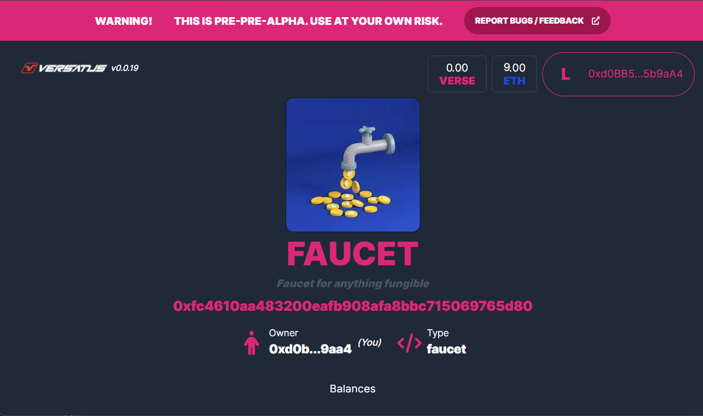

import MediaWrapper from '../../../../src/components/Media/MediaWrapper';

This page guides you through the process of creating a new project using the [Faucet](/lasr/core_concepts/templates#faucet-template). The faucet template is a specialized template for creating new tokens in the network. This template is particularly useful in test networks where tokens have no real-world value. Follow the step-by-step guide below to create and deploy your non-fungible project:

## Step 1: Set Up Your Project

Create your project, with its own directory and add the necessary dependencies to it. Run the following to perform this process:

```bash copy
mkdir faucet-project \
&& cd faucet-project \
&& npm init -y \
&& npm install typescript --save-dev \
&& npx tsc --init \
&& npm install --save @versatus/versatus-javascript
```

## Step 2: Start the Project

Now, initialize a new LASR project. In this guide, you will use the `faucet` template:

```bash copy
npx lasrctl init faucet
```

## Step 3: Set up your Wallet Keys

Replace the `address` and `secret_key` from the `keypairs.json` file with your account keys.

:::info
  If you require assistance finding your keys, refer to the [Creating your First Program](/lasr/creating_your_first_program#step-3-set-up-your-wallet-keys) guide to learn where to find them.
:::

## Step 4: Build Your Program

You need to compile your TypeScript code into JavaScript before deployment. To do this, use the following command:

```bash copy
npx lasrctl build example-program.ts
```

## Step 5: Test Your Program

You can now validate your program's performance against sample JSON inputs that it might encounter in real-world scenarios, as defined by the LASR protocol. To initiate the testing process, use the following command:

```bash copy
npx lasrctl test -b example-program -i example-program-inputs
```

With these tests successfully completed, your program is now prepared for deployment on the LASR network.

## Step 6: Deploy Your Program

You can now start the deploy process using the `npx lasrctl deploy` command. Below is the command you need to run to deploy your `faucet` application:

```bash
npx lasrctl deploy --build example-program --symbol FAUCET --programName "Faucet for anything fungible" --txInputs '{"imgUrl":"https://pbs.twimg.com/profile_images/1421740863139446787/huoxhEV3_400x400.jpg"}'
```

:::info
For detailed information about each standard parameter, refer to the [Deploy Configuration](/lasr/lasr_guides/deploy_configuration) page.
:::

## Interacting With Your Program

Once the deploy is finished, it will  provide you with a URL that can be used in any web browser to interact with your program. This URL will be similar to the following:

```
https://playground.versatus.io/programs/0x0b90aa2e5ce3a9ced87bab04e04508879c8190b7
```

<MediaWrapper>

</MediaWrapper>
