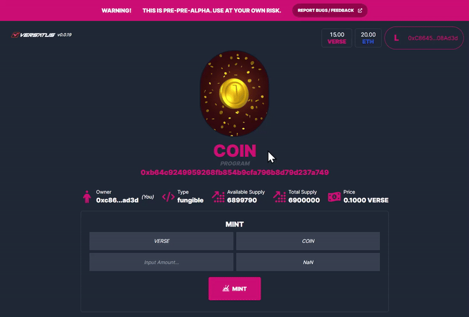

import MediaWrapper from '../../../../src/components/Media/MediaWrapper';

This page guides you through the process of creating a new project using the [Fungible Template](/lasr/core_concepts/templates#fungible-template). The fungible template is designed for projects that require the creation of fungible tokens. Fungible tokens are divisible and can be subdivided into smaller units. Follow the steps-by-step guide below to create and deploy your fungible project:

## Step 1: Set Up Your Project

Create your project, with its own directory and add the necessary dependencies to it. Run the following to perform this process:

```bash copy
mkdir fungible-project \
&& cd fungible-project \
&& npm init -y \
&& npm install typescript --save-dev \
&& npx tsc --init \
&& npm install --save @versatus/versatus-javascript
```

## Step 2: Start the Project

Now, initialize a new LASR project. In this guide, you will use the `fungible` template:

```bash copy
npx lasrctl init fungible
```

## Step 3: Set up your Wallet Keys

Replace the `address` and `secret_key` from the `keypairs.json` file with your account keys.

:::info
  If you require assistance finding your keys, refer to the [Creating your First Program](/lasr/creating_your_first_program#step-3-set-up-your-wallet-keys) guide to learn where to find them.
:::

## Step 4: Build Your Program

You need to compile your TypeScript code into JavaScript before deployment. To do this, use the following command:

```bash copy
npx lasrctl build example-program.ts
```

## Step 5: Test Your Program

You can now validate your program's performance against sample JSON inputs that it might encounter in real-world scenarios, as defined by the LASR protocol. To initiate the testing process, use the following command:

```bash copy
npx lasrctl test -b example-program -i example-program-inputs
```

With these tests successfully completed, your program is now prepared for deployment on the LASR network.

## Step 6: Deploy Your Program

You can now start the deploy process using the `npx lasrctl deploy` command. Below is the command you need to run to deploy your `fungible` application:

```bash copy
npx lasrctl deploy --build example-program --symbol SYMBOL_NAME --programName PROGRAM_NAME --initializedSupply 6900000 --totalSupply 6900000 \
  --txInputs '{"imgUrl":"https://pbs.twimg.com/media/F8z1khNWAAAE7WM?format=jpg&name=900x900","paymentProgramAddress": "PAYMENT_PROGRAM_ADDRESS","conversionRate":"CONVERSION_RATE"}'
```

Make sure to replace the following information:

- `SYMBOL_NAME`: The symbolic name for the token.
- `PROGRAM_NAME`: The name of the program being deployed.
- `PAYMENT_PROGRAM_ADDRESS`: The program address you're going to take for payment when a user mints a token.
- `CONVERSION_RATE`: The conversion rate for your fungible token. For example, if you set it at `1`, this means one of your token is equal to `1 VERSE`.

:::info
For detailed information about each standard parameter, refer to the [Deploy Configuration](/lasr/lasr_guides/deploy_configuration) page.
:::

The fungible deploy, requires the `--txInputs` parameter, with the following data as a JSON:

| Parameter               | Description                                                                                      |
|-------------------------|--------------------------------------------------------------------------------------------------|
| `imgUrl`                | The URL of the image associated with the token being deployed.                                   |
| `paymentProgramAddress` | The wallet address for receiving payments or transactions related to the token being deployed.   |
| `conversionRate`        | The conversion rate for the fungible token being deployed.                                     |

## Interacting With Your Program

Once the deploy is finished, it'll provide you with a URL that can be used in any web browser to interact with your program. This URL will be similar to the following:

```
https://playground.versatus.io/programs/0x0b90aa2e5ce3a9ced87bab04e04508879c8190b7
```

<MediaWrapper>

</MediaWrapper>

:::note
  You will need to have VERSE Credits in your wallet to be able to play around with with your fungible tokens in [LASR Playground](https://playground.versatus.io/). You can access [Versatus Discord](https://discord.com/invite/versatus) server, and request credits through the `/faucet <address>` command in the [faucet channel](https://discord.com/channels/1034112774789414963/1228424731955433493).
:::
