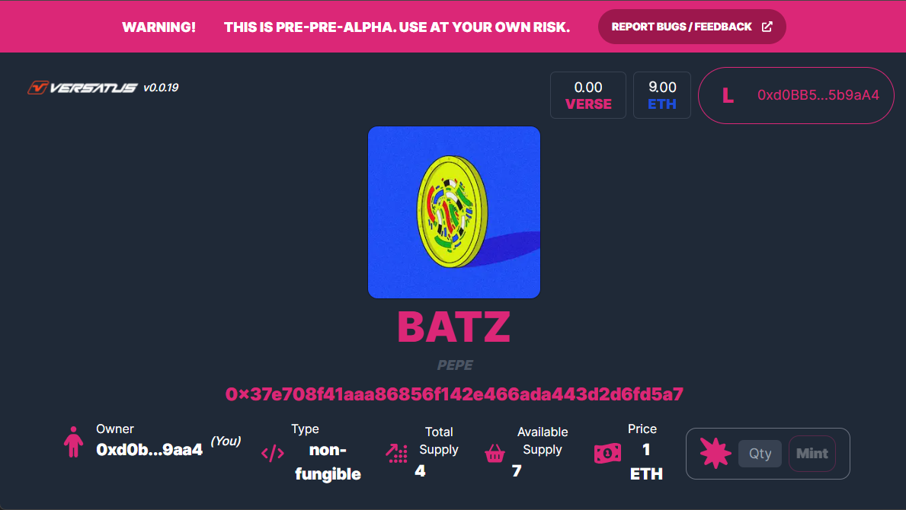

import Steps from '../../../../src/components/Steps/Steps';
import MediaWrapper from '../../../../src/components/Media/MediaWrapper';

This page guides you through the process of creating a new project using the [Non-fungible Template](/core_concepts/templates#non-fungible-template). The non-fungible template is tailored for projects that require non-fungible tokens (NFTs). Unlike fungible tokens, non-fungible tokens cannot be split up. Follow the steps-by-step guide below to create and deploy your non-fungible project:

<Steps>
### Set Up Your Project

Create your project, with its own directory and add the necessary dependencies to it. Run the following to perform all this process:

```bash copy
mkdir non-fungible-project \
&& cd non-fungible-project \
&& npm init -y \
&& npm install typescript --save-dev \
&& npx tsc --init \
&& npm install --save @versatus/versatus-javascript
```

### Start the Project

Now, initialize a new LASR project. In this guide, you will use the `non-fungible` template:

```bash copy
npx lasrctl init non-fungible
```

### Set up your Wallet Keys

Replace the `address` and `secret_key` from the `keypairs.json` file with your account keys.

:::info
  If you require assistance finding your keys, refer to the [Creating your First Program](/getting_started/creating_your_first_program#set-up-your-wallet-keys) guide to learn where to find them.
:::

### Build Your Program

You need to compile your TypeScript code into JavaScript before deployment. To do this, use the following command:

```bash copy
npx lasrctl build example-program.ts
```

### Test Your Program

You can now validate your program's performance against sample JSON inputs that it might encounter in real-world scenarios, as defined by the LASR protocol. To initiate the testing process, use the following command:

```bash copy
npx lasrctl test -b example-program -i example-program-inputs
```

With these tests successfully completed, your program is now prepared for deployment on the LASR network.

### Deploy Your Program

You can now start the deploy process using the `npx lasrctl deploy` command. Below is the command you need to run to deploy your `non-fungible` application:

```bash
npx lasrctl deploy --build example-program --programName "<PROGRAM_NAME>" --symbol <SYMBOL_NAME> --initializedSupply 4 --totalSupply 4 --txInputs '{"imgUrl":"https://i.seadn.io/gcs/files/32d179f19a42ceed7b4727b70d3352bb.jpg?auto=format&dpr=1&w=3840","price":"1","paymentProgramAddress":"<YOUR_WALLET_ADDRESS>","imgUrls":["https://i.seadn.io/gcs/files/5c10e1bf3028476390a65d6726f5340e.jpg?auto=format&dpr=1&w=3840","https://i.seadn.io/s/raw/files/cafd1614da6255ee880254ce349ce866.png?auto=format&dpr=1&w=3840","https://i.seadn.io/gcs/files/6850a6abc69d80c905951316ceb5949b.jpg?auto=format&dpr=1&w=3840","https://i.seadn.io/s/raw/files/94df22c9da16faaf95494f745bcc3e85.png?auto=format&dpr=1&w=3840"],"collection":"batz"}'
```

:::warning
  Sometimes the first try of a deploy may not work, if this happens just rerun the `deploy` command and it will likely succeed on the second try.
:::

Make sure to replace the following information:

- `<SYMBOL_NAME>`: The  symbolic name for the token.
- `<PROGRAM_NAME>`: The name of the program being deployed.
- `<YOUR_WALLET_ADDRESS>`: The address of your wallet.

:::info
For detailed information about each standard parameter, refer to the [Deploy Configuration](/lasr_guides/deploy_configuration) page.
:::

### Interacting With Your Program

Once the deploy is finished, it will  provide you with a URL that can be used in any web browser to interact with your program. This URL will be similar to the following:

```
https://playground.versatus.io/programs/0x0b90aa2e5ce3a9ced87bab04e04508879c8190b7
```

<MediaWrapper>

</MediaWrapper>

</Steps>
