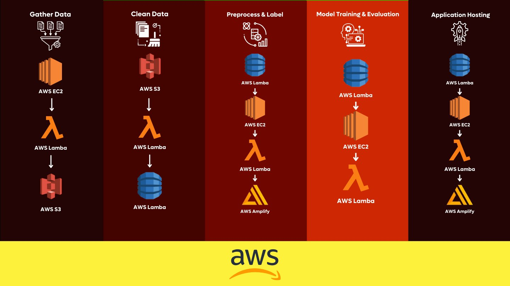
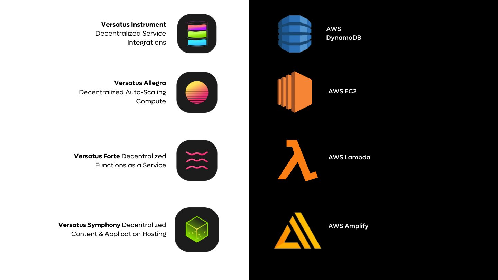
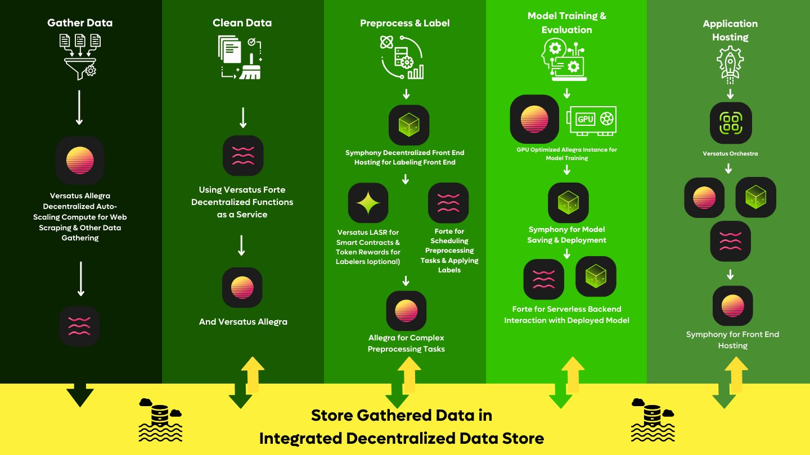

import MediaWrapper from '../../../src/components/Media/MediaWrapper';

The integration of AI into various sectors is set to revolutionize the global economy, enhancing productivity and leveling the playing field across industries. However, deploying AI solutions often involves a centralized infrastructure, which poses risks of control, data access limitations, safety issues, and potential censorship. This page highlights the challenges associated with conventional cloud providers and explores the advantages of Versatus' decentralized solutions.

## Challenges with Conventional Cloud Providers

Conventional cloud services like those offered by AWS, Azure, or Google Cloud involve a centralized infrastructure model. In a fully centralized model, the AI lifecycle would use an infrastructure stack like the one presented in the image below. However, similar infrastructure would be available in Azure and Google Cloud.

<MediaWrapper>

</MediaWrapper>

The above setup presents several risks, such as centralized systems becoming single points of attack for nation-states, malicious bots, and competing AI entities. In addition, businesses must rely on the continued support and neutrality of these large providers, which hold significant market power and may not always align with the interests of their users. There's also a constant risk that crucial components of an AI pipeline may be restricted or censored, impacting the deployment and effectiveness of AI solutions.

Other important points related to centralized cloud services are costs and operational limitations due to the monopolistic nature of large providers. These providers can increase the price without worrying about losing clients due to infrastructural dependencies.

## Versatus Decentralized Solutions

Versatus offers an approach to deploying AI solutions through a decentralized P2P infrastructure. This approach mitigates many risks associated with conventional cloud services while providing services equivalent to those of traditional cloud providers.

<MediaWrapper>

</MediaWrapper>

Versatus provides verifiably censorship-resistant cloud services, ensuring that all stages of the AI lifecycle, from data collection to model deployment, are protected from undue external influence. By decentralizing the control over AI deployment infrastructure, Versatus ensures that no single entity can compromise the integrity or availability of the AI solutions.

The solutions provided by Versatus allow developers to build comprehensive AI/ML pipelines, from data gathering and processing to deployment and hosting, all on a decentralized platform. It supports using smart contracts for incentivizing various AI pipeline tasks such as data cleaning and labeling, enhancing the efficiency and reliability of data processing. In addition, the services provided by Versatus mimic those of traditional cloud services in terms of supported languages and tooling, making the transition seamless for developers used to cloud platforms.

<MediaWrapper>

</MediaWrapper>

By choosing the Versatus services, you will take advantage of the economic security of Ethereum, getting strong safety features without the high costs and difficulties typically associated with being on-chain.