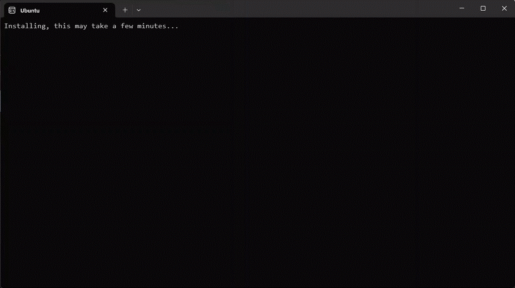

import MediaWrapper from '../../src/components/Media/MediaWrapper';
import Tabs from '@theme/Tabs';
import TabItem from '@theme/TabItem';

Versatus LASR requires Windows Subsystem for Linux (WSL) to function properly on Windows OS. Follow this guide to install WSL and set it up for use with LASR.

## Step 1: Install WSL

You can either install WSL on windows through command line in PowerShell, or Windows Store:

<Tabs>

  <TabItem label="Windows Store" value="Windows Store">
  The following link will guide you to the Windows Store Ubuntu app:

  - [Ubuntu on Windows Store](https://www.microsoft.com/store/productId/9PDXGNCFSCZV?ocid=pdpshare)
  </TabItem>
  <TabItem label="Command Line" value="Command Line">
  The following process will enable the necessary WSL components and install the default Linux distribution (Ubuntu):

  1. Open PowerShell as Administrator. You can do this by searching for "PowerShell" in the Start menu, right-clicking it, and selecting "Run as administrator".
  2. In the PowerShell window, enter the following command and press Enter:

```powershell
wsl --install
```
After running the command above, you will need to restart your computer. Make sure to save your work and then restart your machine.
  </TabItem>

</Tabs>

## Step 2: Set Up Ubuntu

With your Ubuntu installed:

:::tip Verify installation
You can verify the installation on PowerShell with the `wsl --list --verbose` command. You should see a list of installed distributions, with Ubuntu listed and running.
:::

1. Open your Ubuntu distribution from the Start menu.
2. You'll be prompted to create a user account and password for Ubuntu. Follow the on-screen instructions to complete the setup.

The gif below showcases the WSL installation process:

<MediaWrapper>

</MediaWrapper>

## Step 3: Update Ubuntu

1. Once you have set up Ubuntu, it's important to update it. Open the Ubuntu terminal and run the following commands:

```bash
sudo apt update && sudo apt upgrade -y
```

## Step 4: Install Node.js and npm

Now, with your Ubuntu updated, you need to install Node V18 or newer, as [required by Versatus LASR](/lasr/creating_your_first_program#prerequisites). Run the following comands to install the required packages:

```sh
sudo apt install -y nodejs npm
```
Remember to check if your node version is higher than 18. To see what version you currently have installed, run:

```sh
node -v
```

## Creating your First Program with LASR

With all steps completed, you are ready to continue your journey. Start by creating a Hello LASR program by following the [Creating your First Program](/lasr/creating_your_first_program#hello-lasr) guide.

## Additional Resources

Access the following links to learn more about WSL:

- [Official WSL Documentation](https://docs.microsoft.com/en-us/windows/wsl/)
- [Ubuntu on WSL](https://ubuntu.com/wsl)
